* Table of Contents
{:toc}

--------------------------------------------------------------------------------------------------------------------

## **Acknowledgements**

* {list here sources of all reused/adapted ideas, code, documentation, and third-party libraries -- include links to the original source as well}

--------------------------------------------------------------------------------------------------------------------

## **Setting up, getting started**

Refer to the guide [_Setting up and getting started_](SettingUp.md).

--------------------------------------------------------------------------------------------------------------------

## **Design**

:bulb: **Tip:** The `.puml` files used to create diagrams in this document `docs/diagrams` folder. Refer to the [_PlantUML Tutorial_ at se-edu/guides](https://se-education.org/guides/tutorials/plantUml.html) to learn how to create and edit diagrams.

### Architecture

The ***Architecture Diagram*** given above explains the high-level design of the App.

Given below is a quick overview of main components and how they interact with each other.

**Main components of the architecture**

**`Main`** (consisting of classes [`Main`](https://github.com/AY2425S2-CS2103T-W12-3/tp/blob/master/src/main/java/seedu/address/Main.java) and [`MainApp`](https://github.com/AY2425S2-CS2103T-W12-3/tp/blob/master/src/main/java/seedu/address/MainApp.java)) is in charge of the app launch and shut down.
* At app launch, it initializes the other components in the correct sequence, and connects them up with each other.
* At shut down, it shuts down the other components and invokes cleanup methods where necessary.

The bulk of the app's work is done by the following four components:

* [**`UI`**](#ui-component): The UI of the App.
* [**`Logic`**](#logic-component): The command executor.
* [**`Model`**](#model-component): Holds the data of the App in memory.
* [**`Storage`**](#storage-component): Reads data from, and writes data to, the hard disk.

[**`Commons`**](#common-classes) represents a collection of classes used by multiple other components.

**How the architecture components interact with each other**

The *Sequence Diagram* below shows how the components interact with each other for the scenario where the user issues the command `delete 1`.

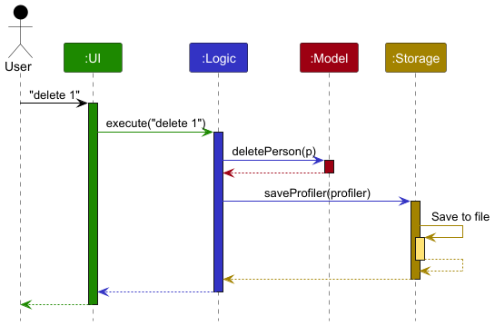

Each of the four main components (also shown in the diagram above),

* defines its *API* in an `interface` with the same name as the Component.
* implements its functionality using a concrete `{Component Name}Manager` class (which follows the corresponding API `interface` mentioned in the previous point.

For example, the `Logic` component defines its API in the `Logic.java` interface and implements its functionality using the `LogicManager.java` class which follows the `Logic` interface. Other components interact with a given component through its interface rather than the concrete class (reason: to prevent outside component's being coupled to the implementation of a component), as illustrated in the (partial) class diagram below.

The sections below give more details of each component.

### UI component

The **API** of this component is specified in [`Ui.java`](https://github.com/AY2425S2-CS2103T-W12-3/tp/blob/master/src/main/java/seedu/address/ui/Ui.java)

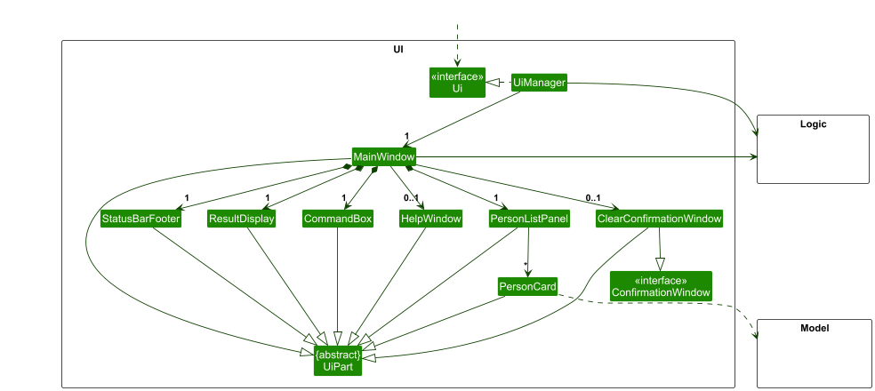

The UI consists of a `MainWindow` that is made up of parts e.g.`CommandBox`, `ResultDisplay`, `PersonListPanel`, `StatusBarFooter` etc. All these, including the `MainWindow`, inherit from the abstract `UiPart` class which captures the commonalities between classes that represent parts of the visible GUI.

The `UI` component uses the JavaFx UI framework. The layout of these UI parts are defined in matching `.fxml` files that are in the `src/main/resources/view` folder. For example, the layout of the [`MainWindow`](https://github.com/AY2425S2-CS2103T-W12-3/tp/blob/master/src/main/java/seedu/address/ui/MainWindow.java) is specified in [`MainWindow.fxml`](https://github.com/AY2425S2-CS2103T-W12-3/tp/blob/master/src/main/resources/view/MainWindow.fxml).

The `ClearConfirmationWindow` class implements the `ConfirmationWindow` interface. This design allows for the use of a test stub, `ClearConfirmationWindowStub`, which also implements the `ConfirmationWindow` interface. The purpose of this stub is to facilitate unit testing by enabling the injection of a mock confirmation window during JUnit tests.

The `UI` component,

* executes user commands using the `Logic` component.
* listens for changes to `Model` data so that the UI can be updated with the modified data.
* keeps a reference to the `Logic` component, because the `UI` relies on the `Logic` to execute commands.
* depends on some classes in the `Model` component, as it displays `Person` object residing in the `Model`.

### Logic component

**API** : [`Logic.java`](https://github.com/AY2425S2-CS2103T-W12-3/tp/blob/master/src/main/java/seedu/address/logic/Logic.java)

Here's a (partial) class diagram of the `Logic` component:

The sequence diagram below illustrates the interactions within the `Logic` component, taking `execute("delete 1")` API call as an example.

:information_source: **Note:** The lifeline for `DeleteCommandParser` should end at the destroy marker (X) but due to a limitation of PlantUML, the lifeline continues till the end of diagram.

How the `Logic` component works:

1. When `Logic` is called upon to execute a command, it is passed to an `ProfilerParser` object which in turn creates a parser that matches the command (e.g., `DeleteCommandParser`) and uses it to parse the command.
1. This results in a `Command` object (more precisely, an object of one of its subclasses e.g., `DeleteCommand`) which is executed by the `LogicManager`.
1. The command can communicate with the `Model` when it is executed (e.g. to delete a student). 
   Note that although this is shown as a single step in the diagram above (for simplicity), in the code it can take several interactions (between the command object and the `Model`) to achieve.
1. The result of the command execution is encapsulated as a `CommandResult` object which is returned back from `Logic`.

Here are the other classes in `Logic` (omitted from the class diagram above) that are used for parsing a user command:

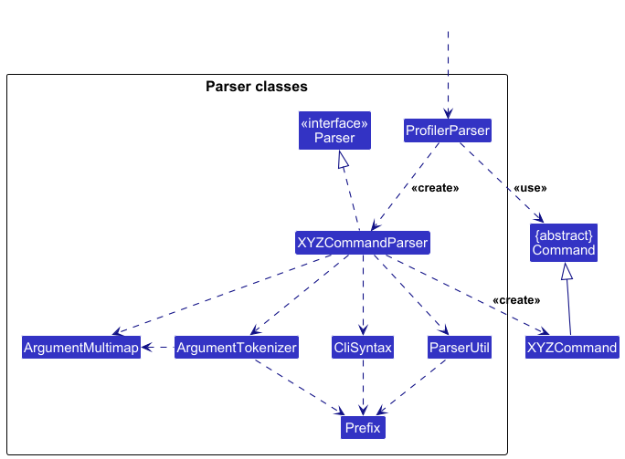

How the parsing works:
* When called upon to parse a user command, the `ProfilerParser` class creates an `XYZCommandParser` (`XYZ` is a placeholder for the specific command name e.g., `AddCommandParser`) which uses the other classes shown above to parse the user command and create a `XYZCommand` object (e.g., `AddCommand`) which the `ProfilerParser` returns back as a `Command` object.
* All `XYZCommandParser` classes (e.g., `AddCommandParser`, `DeleteCommandParser`, ...) inherit from the `Parser` interface so that they can be treated similarly where possible e.g, during testing.

#### Special Case: `ClearCommandParser`:
This class has an overloaded constructor, allowing for injection of a stub class `ClearConfirmationWindowStub` for unit tests, with the help of `ConfirmationWindowFactory`.

### Model component
**API** : [`Model.java`](https://github.com/AY2425S2-CS2103T-W12-3/tp/blob/master/src/main/java/seedu/address/model/Model.java)

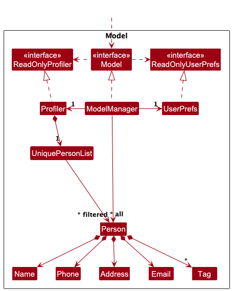

The `Model` component,

* stores the profiler data i.e., all `Person` objects (which are contained in a `UniquePersonList` object).
* stores the currently 'selected' `Person` objects (e.g., results of a search query) as a separate _filtered_ list which is exposed to outsiders as an unmodifiable `ObservableList<Person>` that can be 'observed' e.g. the UI can be bound to this list so that the UI automatically updates when the data in the list change.
* stores a `UserPref` object that represents the user’s preferences. This is exposed to the outside as a `ReadOnlyUserPref` objects.
* does not depend on any of the other three components (as the `Model` represents data entities of the domain, they should make sense on their own without depending on other components)

:information_source: **Note:** An alternative (arguably, a more OOP) model is given below. It has a `Tag` list in the `Profiler`, which `Person` references. This allows `Profiler` to only require one `Tag` object per unique tag, instead of each `Person` needing their own `Tag` objects. 

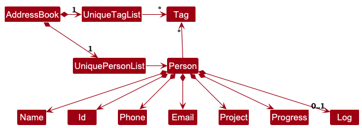

### Storage component

**API** : [`Storage.java`](https://github.com/AY2425S2-CS2103T-W12-3/tp/blob/master/src/main/java/seedu/address/storage/Storage.java)

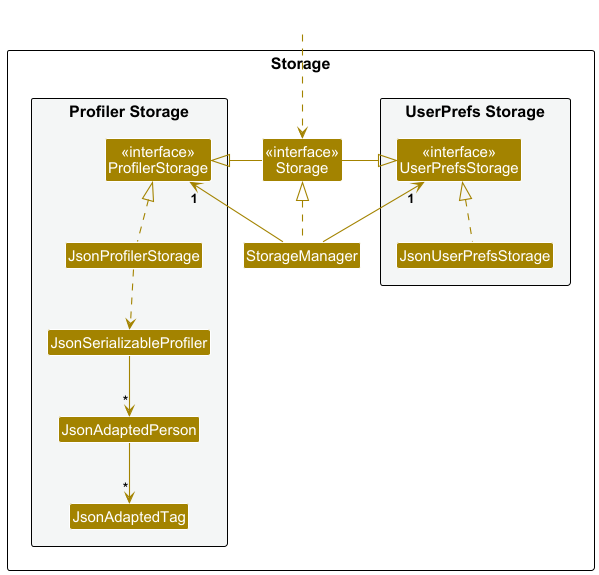

The `Storage` component,
* can save both profiler data and user preference data in JSON format, and read them back into corresponding objects.
* inherits from both `ProfilerStorage` and `UserPrefStorage`, which means it can be treated as either one (if only the functionality of only one is needed).
* depends on some classes in the `Model` component (because the `Storage` component's job is to save/retrieve objects that belong to the `Model`)

### Common classes

Classes used by multiple components are in the `seedu.address.commons` package.

--------------------------------------------------------------------------------------------------------------------

## **Implementation**

This section describes some noteworthy details on how certain features are implemented.

### Sort feature

#### Current Implementation
The `SortCommand` is responsible for sorting students in Prof-iler based on their progress, in either ascending (`asc`) or descending (`desc`) order. It interacts with the `Model` component to update the displayed student list based on the specified sorting order.

#### Class Structure
##### `SortCommand`
- `SortCommand` extends `Command`
- Stores a boolean flag `isAscending` to determine sorting order
- Executes sorting using a `Comparator<Person>` comparator on student's progress values
- Calls `model.updateSortedPersonList(comparator)` to update the list

##### `SortCommandParser`
- Implements `Parser<SortCommand>`
- Parses user input to determine sorting order
- Throws a `ParseException` if input is invalid

##### `Logic` Interface
- Declares `getSortedPersonList()` for obtaining a sorted student list

##### `LogicManager`
- Implements `Logic`
- Handles command execution and updates the stored profiler after sorting
- Overrides the `getSortedPersonList` to obtain the sorted list from model

##### `Model` Interface
- Declares `updateSortedPersonList(Comparator<Person>)`
- Declares `getSortedPersonList`
- Updates the internal representation of the sorted student list

##### `ModelManager`
- Initializes `sortedPersons` as a `SortedList<Person>` with reference to `filteredPerson`
- Overrides `getSortedPersonList` to return the sorted list
- Overrides `updateSortedPersonList` to update and sort the list based on the comparator

#### Execution Flow
1. **User Input**: The user inputs the command `sort asc` or `sort desc`.
2. **Parsing**: `SortCommandParser` extracts sorting order from the user input.
3. **Command Execution**: The `SortCommand` applies the comparator and calls `model.updateSortedPersonList(comparator)` to update the `Model`.
4. **Model Update**: The `ModelManager` updates the internal `sortedPersons` list to reflect the new sorting order.
5. **Storage Update**: The sorted data is saved to the storage file.

The following sequence diagram shows how the `sort asc` operation works:
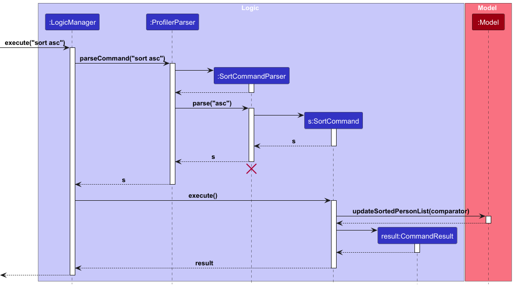

#### Design considerations:
**Aspect: How sorting is executed:**
* **Alternative 1 (current choice):** Uses a comparator to sort the list of students.
* Pros: Easy to implement and understand
* Cons: May have performance issues for very large lists.

* **Alternative 2:** Implement a custom sorting algorithm
* Pros: Can be optimized for specific use cases.
* Cons: More complex to implement and maintain.

#### Interactions with other features:
**Integration with `FilterCommand`**
- The `SortCommand` works in conjunction with `FilterCommand` to refine and organize displayed results
- Users can first apply a filter (e.g., `filter pr/ <ProjectName>`) to view the students in the project that contains any of the given keywords.
- After filtering, users can execute `sort asc` to arrange students in those projects based on their progress in ascending order.
- This ensures that sorting only affects the currently displayed subset rather than the entire student list.

### \[Proposed\] Undo/redo feature

#### Proposed Implementation

The proposed undo/redo mechanism is facilitated by `VersionedProfiler`. It extends `Profiler` with an undo/redo history, stored internally as an `profilerStateList` and `currentStatePointer`. Additionally, it implements the following operations:

* `VersionedProfiler#commit()` — Saves the current profiler state in its history.
* `VersionedProfiler#undo()` — Restores the previous profiler state from its history.
* `VersionedProfiler#redo()` — Restores a previously undone profiler state from its history.

These operations are exposed in the `Model` interface as `Model#commitProfiler()`, `Model#undoProfiler()` and `Model#redoProfiler()` respectively.

Given below is an example usage scenario and how the undo/redo mechanism behaves at each step.

Step 1. The user launches the application for the first time. The `VersionedProfiler` will be initialized with the initial profiler state, and the `currentStatePointer` pointing to that single profiler state.

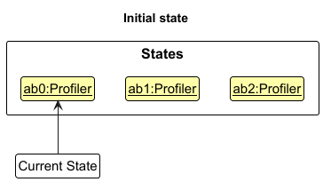

Step 2. The user executes `delete 5` command to delete the 5th student in the profiler. The `delete` command calls `Model#commitProfiler()`, causing the modified state of the profiler after the `delete 5` command executes to be saved in the `profilerStateList`, and the `currentStatePointer` is shifted to the newly inserted profiler state.

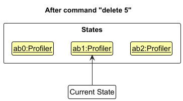

Step 3. The user executes `add n/David …​` to add a new student. The `add` command also calls `Model#commitProfiler()`, causing another modified profiler state to be saved into the `profilerStateList`.

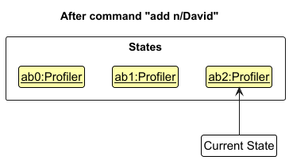

:information_source: **Note:** If a command fails its execution, it will not call `Model#commitProfiler()`, so the profiler state will not be saved into the `profilerStateList`.

Step 4. The user now decides that adding the student was a mistake, and decides to undo that action by executing the `undo` command. The `undo` command will call `Model#undoProfiler()`, which will shift the `currentStatePointer` once to the left, pointing it to the previous profiler state, and restores the profiler to that state.

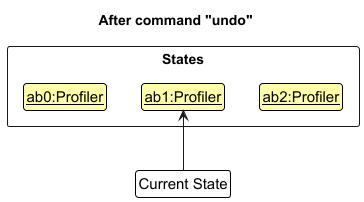

:information_source: **Note:** If the `currentStatePointer` is at index 0, pointing to the initial Profiler state, then there are no previous Profiler states to restore. The `undo` command uses `Model#canUndoProfiler()` to check if this is the case. If so, it will return an error to the user rather
than attempting to perform the undo.

The following sequence diagram shows how an undo operation goes through the `Logic` component:

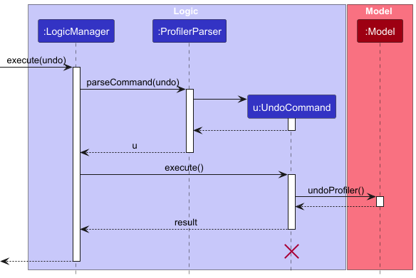

:information_source: **Note:** The lifeline for `UndoCommand` should end at the destroy marker (X) but due to a limitation of PlantUML, the lifeline reaches the end of diagram.

Similarly, how an undo operation goes through the `Model` component is shown below:

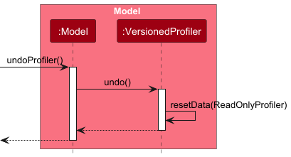

The `redo` command does the opposite — it calls `Model#redoProfiler()`, which shifts the `currentStatePointer` once to the right, pointing to the previously undone state, and restores the profiler to that state.

:information_source: **Note:** If the `currentStatePointer` is at index `profilerStateList.size() - 1`, pointing to the latest profiler state, then there are no undone Profiler states to restore. The `redo` command uses `Model#canRedoProfiler()` to check if this is the case. If so, it will return an error to the user rather than attempting to perform the redo.

Step 5. The user then decides to execute the command `list`. Commands that do not modify the profiler, such as `list`, will usually not call `Model#commitProfiler()`, `Model#undoProfiler()` or `Model#redoProfiler()`. Thus, the `profilerStateList` remains unchanged.

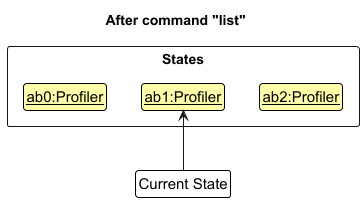

Step 6. The user executes `clear`, which calls `Model#commitProfiler()`. Since the `currentStatePointer` is not pointing at the end of the `profilerStateList`, all profiler states after the `currentStatePointer` will be purged. Reason: It no longer makes sense to redo the `add n/David …​` command. This is the behavior that most modern desktop applications follow.

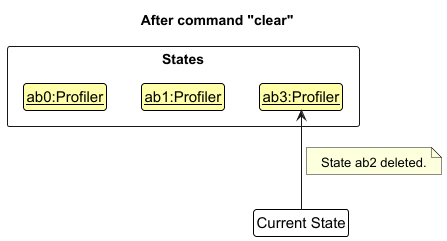

The following activity diagram summarizes what happens when a user executes a new command:

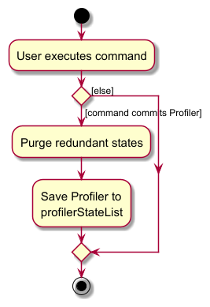

#### Design considerations:

**Aspect: How undo & redo executes:**

* **Alternative 1 (current choice):** Saves the entire profiler.
  * Pros: Easy to implement.
  * Cons: May have performance issues in terms of memory usage.

* **Alternative 2:** Individual command knows how to undo/redo by
  itself.
  * Pros: Will use less memory (e.g. for `delete`, just save the student being deleted).
  * Cons: We must ensure that the implementation of each individual command are correct.

_{more aspects and alternatives to be added}_

### \[Proposed\] Data archiving

_{Explain here how the data archiving feature will be implemented}_

--------------------------------------------------------------------------------------------------------------------

## **Documentation, logging, testing, configuration, dev-ops**

* [Documentation guide](Documentation.md)
* [Testing guide](Testing.md)
* [Logging guide](Logging.md)
* [Configuration guide](Configuration.md)
* [DevOps guide](DevOps.md)

--------------------------------------------------------------------------------------------------------------------

## **Appendix: Requirements**

### Product scope

**Target user profile**: Research Professors in SoC

* has a need to manage a significant number of student researcher contacts and details
* prefer desktop apps over other types
* can type fast
* prefers typing to mouse interactions
* is reasonably comfortable using CLI apps

**Value proposition**: A management system designed to help SoC professors organize, track, and maintain student research records over time that is optimized for use via Command Line Interface (CLI) while having the benefits of a Graphical User Interface (GUI).

### User stories

Priorities: High (must have) - `* * *`, Medium (nice to have) - `* *`, Low (unlikely to have) - `*`

| Priority | As a …​                     | I want to …​                                                             | So that I can…​                                                                   |
|----------|-----------------------------|--------------------------------------------------------------------------|-----------------------------------------------------------------------------------|
| `* * *`  | Professor at SoC            | view all current research students under me                              | quickly access the list of current students                                       |
| `* * *`  | Professor at SoC            | delete student entries that are no longer active                         | keep the database current and relevant                                            |
| `* * *`  | Professor at SoC            | add a new student to a specific project                                  | know who are part of that specific project                                        |
| `* *`    | Professor at SoC            | filter students based on projects and tags                               | quickly find suitable students without going through the whole list               |
| `* *`    | Professor at SoC            | find a student's name in the directory                                   | remember what project this student worked on under me                             |
| `* *`    | Professor at SoC            | mark student milestones as complete                                      | track the students' progress over the semester                                    |
| `* *`    | Professor at SoC            | update and edit student information                                      | have the most up-to-date information regarding the student                        |
| `* *`    | Professor at SoC            | tag what project the students are doing                                  | quickly know who to contact for a particular research                             |
| `* *`    | Professor at SoC            | retrieve recently deleted changes                                        | retrieve wrongly deleted data efficiently                                         |
| `* *`    | Professor at SoC            | update progress of a student                                             | monitor and update the student's progress in that project                         |
| `* *`    | Professor at SoC            | Sort students based on the progress                                      | know which students are behind progress                                           |
| `* *`    | Professor at SoC            | delete multiple students at once                                         | perform delete faster when I have multiple students to delete                     |
| `* *`    | Professor at SoC            | clear all data at once                                                   | prepare for a new academic year                                                   |
| `* *`    | Professor at SoC            | be asked for confirmation when clearing data                             | prevent accidentally clearing all data                                            |
| `* *`    | Professor at SoC            | be notified when there are any duplicate entries                         | keep the data relevant                                                            |
| `* *`    | Professor at SoC            | clear students from a specific project after the project is completed    | keep track of just the ongoing projects                                           |
| `* *`    | Professor at SoC            | find all active research in a summary dashboard                          | get a quick overview of all the ongoing research                                  |
| `* *`    | Professor at SoC            | receive reminders about the upcoming student deadlines                   | ensure timely feedback and submissions                                            |
| `* *`    | Professor at SoC            | find students working on similar projects in the past                    | link up current students to past students for mentoring                           |
| `* *`    | Professor at SoC            | undo changes                                                             | maintain productivity when I accidentally make unwanted changes                   |
| `* *`    | Professor at SoC            | redo changes                                                             | change in case I change my mind after undoing a change                            |
| `* *`    | Professor at SoC            | have a help command                                                      | see all available commands                                                        |
| `* *`    | Professor at SoC            | use shortcuts to type a command faster                                   | retrieve information faster                                                       |
| `* *`    | Professor at SoC            | use shortcuts to add new student profiles                                | create users quicker                                                              |
| `* *`    | Professor at SoC            | log notes about students                                                 | refer to them in the future and find out additional information about the student |
| `* *`    | Professor at SoC            | set a preferred name for my students                                     | know what to call them                                                            |
| `* *`    | Forgetful Professor at SoC  | set profile picture for my students                                      | remember how they look like                                                       |
| `*`      | Vain Professor at SoC       | set my own profile picture                                               | admire my face everytime I use the application                                    |
| `*`      | Professor at SoC            | export data about student research into a report format                  | share my research easily                                                          |
| `*`      | Forgetful Professor at SoC  | log research meetings with students                                      | do not forgot what we discussed in the meeting                                    |
| `*`      | Professor at SoC            | maintain a professional network with past students                       | reconnect with them for future collaboration                                      |
| `*`      | Professor at SoC            | create charts and diagrams to compare students across multiple semesters | decide if I need to take in more students for my projects                         |
| `*`      | Professor at SoC            | export each student's grades for the current semester                    | update their grades into the system easily                                        |
| `*`      | Professor at SoC            | color tag each students                                                  | sort them effectively                                                             |

*{More to be added}*

### Use cases

(For all use cases below, the **System** is the `Prof-iler` and the **Actor** is the `user`, unless specified otherwise)

#### **Use case: UC01 List all students under User**

**MSS**

1. User request to list all students.
2. Prof-iler displays the list of all students under user.

   Use case ends.

**Extensions**
* 2a. The List is empty.

    Use case ends.

#### **Use case: UC02 Delete a student**

**MSS**

1.  User requests to <a href="#use-case-uc01-list-all-students-under-user" style="text-decoration: underline;">
    list all students (UC01)
    </a>
2.  Prof-iler shows a list of students.
3.  User requests to delete the specific students in the list.
4.  Prof-iler deletes the students.  
    Use case ends.

**Extensions**

* 3a. The given index is invalid.

    * 3a1. Prof-iler shows an error message.

      Use case resumes at step 2.

#### **Use case: UC03 Add a student**

**MSS**

1. User requests to add the student.
2. User enters the required details to add a student.
3. Prof-iler adds the student.
4. Prof-iler displays the added student.

    Use case ends.

**Extensions**
* 2a. The input is invalid.
    * 2a1. Prof-iler shows an error message.

      Use case ends.
* 2b. The student already exists.
    * 2b1. Prof-iler shows an error message. 

      Use case ends.

#### **Use case: UC04 Edit a student**

**MSS**

1. User request to edit the details of a specific student.
2. User enters the required input and details to be edited for that student.
3. Prof-iler updates the student with the new details.  
   Use case ends. 

**Extensions**
* 2a. The input is invalid.
    * 2a1. Prof-iler shows an error message. 
    Use case ends.

#### **Use case: UC05 Update progress of a student**

**MSS**
1. User request to update the progress of the project of a specific student.
2. User enters the required input and the new progress value.
3. Prof-iler updates the progress of the project. 
Use case ends. 

**Extensions**
* 2a. The input is invalid.
    * 2a1. Prof-iler shows an error message indicating invalid input. 
  Use case ends. 
* 2b. The progress value is invalid.
    * 2b1. Prof-iler shows an error message indicating invalid progress. 
  Use case ends.

#### **Use case: UC06 Log notes about a student**

**MSS**
1. User request to log some notes of a specific student.
2. User enters the required input and notes regarding the student.
3. Prof-iler logs the students with the given notes. 
Use case ends. 

**Extensions**
* 2a. The input is invalid.
    * 2a1. Prof-iler shows an error message. 
  Use case ends. 

#### **Use case: UC07 Find students based on their name**

**MSS**
1. User requests to find certain students based on the names.
2. User enters the required inputs and the keywords.
3. Prof-iler searches for the students based on the keywords.
4. Prof-iler displays all the students that matches the keywords.  
Use case ends. 

**Extensions**
* 2a. The input is invalid.
    * 2a1. Prof-iler shows an error message. 
  Use case ends. 

* 3a. No student's name matches the keywords.
    * 3a1. Prof-iler shows a message indicating that no student's name matches the keywords. 
  Use case ends. 

#### **Use case: UC08 Filter students based on project**

**MSS**
1. User requests to filter students based on their project.
2. User enters the required inputs and the keywords.
3. Prof-iler searches for students with the project that matches the keywords.
4. Prof-iler displays all the students with projects that match the keywords. 
Use case ends.  

**Extensions**
* 2a. The input is invalid.
    * 2a1. Prof-iler shows an error message. 
  Use case ends. 
* 3a. No project matches the given keyword.
    * 3a1. Prof-iler shows a message indicating that no project matches the keywords. 
  Use case ends. 

#### **Use case: UC09 Sort students based on order of progress**

**MSS**
1. User requests to sort students based on the order of progress.
2. User enters the required inputs and the order.
3. Prof-iler arranges the students based on the given order.
4. Prof-iler displays the students in the given order. 
Use case ends. 

**Extensions**
* 2a. The input format is invalid.
    * 2a1. Prof-iler shows an error message. 
  Use case ends. 
* 2b. The given order is invalid.
    * 2b1. Prof-iler shows an error message indicating invalid order. 
  Use case ends. 

#### **Use case: UC10 Clear all entries**

**MSS**
1. User request to clear all entries.
2. Prof-iler asks for confirmation.
3. Prof-iler clears all entries. 
Use case ends. 

**Extensions**
* 2a. The user declines the clearing of all entries. 
Use case ends. 

### Non-Functional Requirements

1.  Should work on any _mainstream OS_ as long as it has Java `17` or above installed.
2.  Should be able to hold up to 1000 students without a noticeable sluggishness in performance for typical usage.
3.  A user with above average typing speed for regular English text (i.e. not code, not system admin commands) should be able to accomplish most of the tasks faster using commands than using the mouse.
4.  The datafile created by the program should be stored in a human-readable format.
5.  Should work without requiring installation (i.e. packaged as a .jar file).
6.  Should work without an internet connection, without depending on an online server.
7.  Should follow the Object-oriented paradigm for ease of future expansion, where commands can be added with minimal changes to existing code.
8.  The GUI should not cause any resolution-related inconveniences to the user for standard screen resolutions 1920x1080 and higher, and, for screen scales 100% and 125%. It should remain usable (all functions can be used even if the user experience is not optimal) for resolutions 1280x720 and higher, and, for screen scales 150%.
9.  The file size for the .jar file should not exceed 100MB, and documents like PDF files should not exceed 15MB/file.

### Glossary
* **Mainstream OS**: Windows, Linux, Unix, MacOS
* **Private contact detail**: A contact detail that is not meant to be shared with others
* **Use case**: Description of a set of sequences of actions, including variants, that a system performs to yield an observable result of value to an actor (role played by user)
* **MSS (Main Success Scenario)**: Describes the most straightforward interaction for a given use case, which assumes that nothing goes wrong
* **Extensions**: "Add-on"s to the MSS that describe exceptional/alternative flow of events
* **Student ID**: A unique identifier assigned to each student by the university
* **Project**: The title of the research project a student is working on

--------------------------------------------------------------------------------------------------------------------

## **Appendix: Instructions for manual testing**

Given below are instructions to test the app manually.

:information_source: **Note:** These instructions only provide a starting point for testers to work on;
testers are expected to do more *exploratory* testing.

### Launch and shutdown

1. Initial launch

   1. Download the jar file and copy into an empty folder

   1. Double-click the jar file Expected: Shows the GUI with a set of sample contacts. The window size may not be optimum.

1. Saving window preferences

   1. Resize the window to an optimum size. Move the window to a different location. Close the window.

   1. Re-launch the app by double-clicking the jar file. 
       Expected: The most recent window size and location is retained.

### Deleting a student

1. Deleting a student while all students are being shown

   1. Prerequisites: List all students using the `list` command. Multiple students in the list.

   1. Test case: `delete 1` 
      Expected: First contact is deleted from the list. Details of the deleted contact shown in the status message. Timestamp in the status bar is updated.

   1. Test case: `delete 0` 
      Expected: No student is deleted. Error details shown in the status message. Status bar remains the same.

   1. Other incorrect delete commands to try: `delete`, `delete x`, `...` (where x is larger than the list size) 
      Expected: Similar to previous.

### Sort Function

1. **Sorting students by progress**

   1. **Test case: `sort asc`**
      - **Expected:** Students are displayed in ascending order of their progress.

   1. **Test case: `sort desc`**
      - **Expected:**  Students are displayed in descending order based on their progress values.

   1. **Invalid test case: `sort invalid`**
      - **Expected:**  The application shows an error message detailing the usage of `sort`.

#### Filter Function

1. **Filtering students by project**

   1. **Prerequisites:** At least one student with project containing the word `Prof-iler`, and no students with project containing the word `Invalid`.

   1. **Test case: `filter pr/Prof-iler`**
      - **Expected:**  Only students associated with the project "Prof-iler" are shown.

   1. **Test case: `filter pr/Invalid`**
      - **Expected:** An empty list is displayed.

1. **Filtering students by tag**

   1. **Prerequisites:** At least one student with tag containing the word `Y4`, and no students with tag containing the word `Invalid`.

   1. **Test case: `filter t/Y4`**
      - **Expected:** Only students tagged with "Y4" are shown.

   2. **Test case: `filter t/Invalid`**
      - **Expected:** An empty list is displayed.

3. **Test case: Invalid command**
   - **Command:** `filter pr/Prof-iler t/Y4`
   - **Expected:**  The application shows an error message: `Should only have one of pr/ or t/`.

## **Appendix: Planned Enhancements**
Team Size: 5
1. Update light theme for confirmation window when clearing records. 
2. Improve UI to cater to extremely long values. Currently, if values are over a certain number of characters, it will be concatenated with `...`.
3. Allow change of theme with CLI command, to conform to `Recommendation-CLI-First`.
4. Allow help window to be closed via keyboard command, such as using the `esc` key.
5. Allow `Filter Command` to filter for projects that contain prefixes such as `pr/` and `t/` without error. Since a project name can take any value, the users are allowed to add projects with names such as pr/Project Prof-iler or even t/Project Orbital. However, `filter` command is not able to filter such projects efficiently in the presence of leading whitespaces in between commands. For example, `filter pr/   pr/Project Prof-iler` will lead to an error to indicate the presence of multiple prefixes `pr/`, similar for prefix `t/`. However, `filter pr/pr/Project Prof-iler` will work. This feature will be fixed in the future to ensure that `filter` command is able to parse any string after the prefix `pr/` and `t/` accurately while ignoring leading and trailing white spaces to achieve filtering of projects that contains prefixes `pr/` and `t/` in their name.
6. Allow names to accept special prefixes such as s/o, d/o, w/o, and @.
