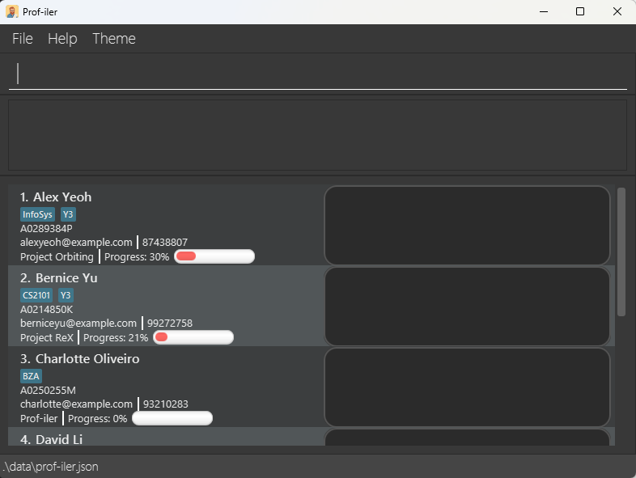
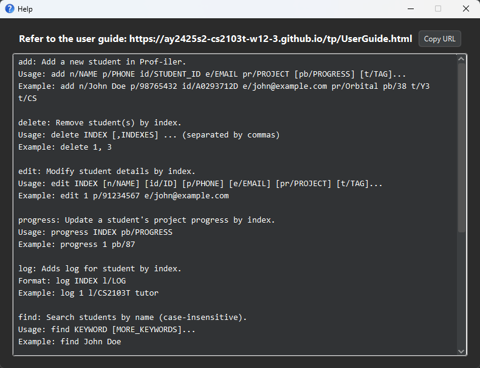
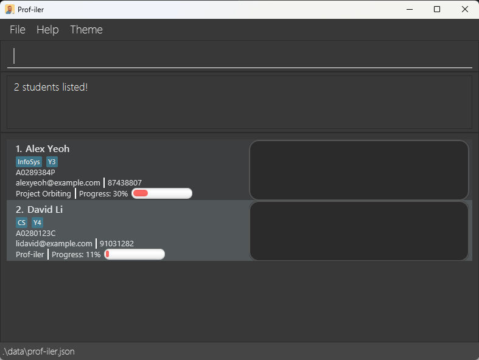
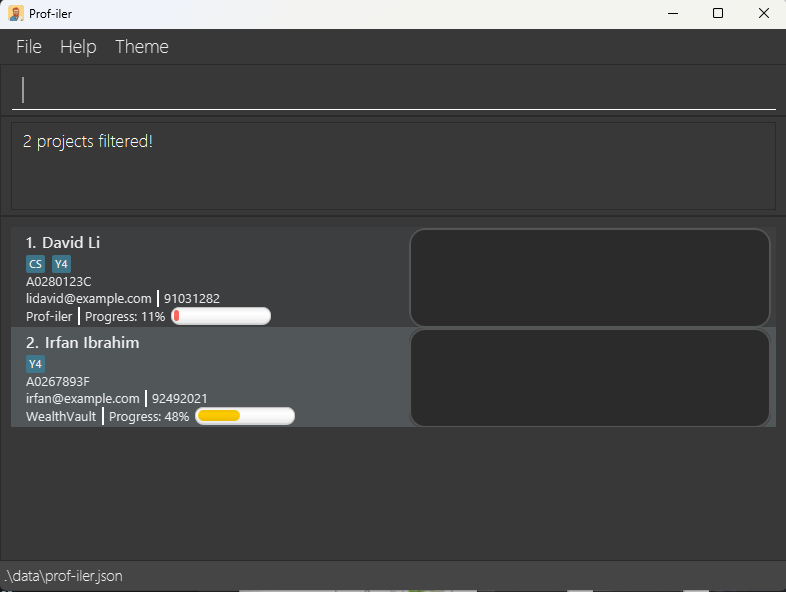
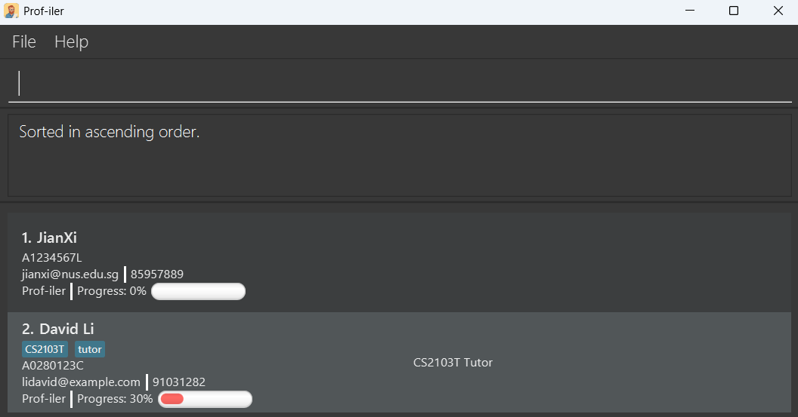
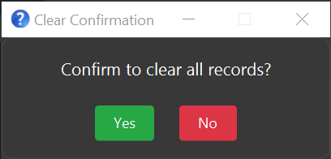

Prof-iler is a **desktop app for managing student research records, optimized for use via a Command Line Interface** (CLI) while still having the benefits of a Graphical User Interface (GUI). Designed for fast typing research professors at SoC, Prof-iler helps streamline research management by organizing, tracking, and maintaining student records over time. These tasks can be done faster than traditional GUI apps.

* Table of Contents
{:toc}

--------------------------------------------------------------------------------------------------------------------

## Quick start

1. Ensure you have Java `17` or above installed in your Computer. 
   **Mac users:** Ensure you have the precise JDK version prescribed [here](https://se-education.org/guides/tutorials/javaInstallationMac.html).

2. Download the latest `.jar` file from [here](https://github.com/AY2425S2-CS2103T-W12-3/tp/releases).

3. Copy the file to the folder you want to use as the _home folder_ for your Prof-iler application.

4. Open a command terminal, `cd` into the folder you put the jar file in, and use the `java -jar Prof-iler.jar` command to run the application. 
   A GUI similar to the below should appear in a few seconds. Note how the app contains some sample data. 
   

5. Type the command in the command box and press Enter to execute it. e.g. typing **`help`** and pressing Enter will open the help window. 
   Some example commands you can try:

   * `list` : Lists all contacts.

   * `add n/John Doe p/98765432 id/A0253517M e/johnd@example.com pr/Prof-iler pb/72 t/Y3` : Adds a contact named `John Doe` to Prof-iler

   * `delete 3` : Deletes the 3rd contact shown in the current list.

   * `clear` : Deletes all contacts.

   * `exit` : Exits the app.

6. Refer to the [Features](#features) below for details of each command.

--------------------------------------------------------------------------------------------------------------------

## Features

**:information_source: Notes about the command format:** 

* Words in `UPPER_CASE` are the parameters to be supplied by the user. 
  e.g. in `add n/NAME`, `NAME` is a parameter which can be used as `add n/John Doe`.

* Items in square brackets are optional. 
  e.g. `n/NAME [t/TAG]` can be used as `n/John Doe t/Y4` or as `n/John Doe`.

* Items with `…`​ after them can be used multiple times including zero times. 
  e.g. `[t/TAG]…​` can be used as ` ` (i.e. 0 times), `t/Y4`, `t/CS t/Y4` etc. 
  e.g. `pr/KEYWORD...` can be used as `pr/Prof-iler` ` ` (i.e. 0 times), `pr/Project Prof-iler` (i.e. 1 time), `pr/Project Orbital Apollo` (i.e. 2 times).

* Parameters can be in any order. 
  e.g. if the command specifies `n/NAME p/PHONE_NUMBER`, `p/PHONE_NUMBER n/NAME` is also acceptable.

* Extraneous parameters for commands that do not take in parameters (such as `help`, `list`, `exit` and `clear`) will be ignored. 
  e.g. if the command specifies `help 123`, it will be interpreted as `help`.

* If you are using a PDF version of this document, be careful when copying and pasting commands that span multiple lines as space characters surrounding line-breaks may be omitted when copied over to the application.

### Viewing help : `help`

Shows a link to the user guide and a list of all commands available in Prof-iler.

Format: `help`, can also be accessed via `F1` function key

### Adding a student: `add`

Adds a student to Prof-iler.

Format: `add n/NAME id/STUDENT_ID p/PHONE e/EMAIL pr/PROJECT [pb/PROGRESS] [t/TAG]…​`

* All included fields must not be blank.
* `NAME` should only contain alphanumeric characters and spaces.
* `STUDENT_ID` is unique, should start with `A` or `a`, followed by 7 digits, and end with a letter.
* `PHONE` should only contain numbers, and it should be 3 - 15 digits long.
* `EMAIL` should be of the format `local-part@domain` and adhere to the following constraints:
  * The local-part should only contain alphanumeric characters and the special characters `+_.-`.
  * The local-part may not start or end with any special characters.
  * The local-part may not contain consecutive special characters.
  * This is followed by `@` and then a domain name.
  * The domain name is made up of domain labels separated by periods, and must:
    * end with a domain label at least 2 characters long,
    * have each domain label start and end with alphanumeric characters,
    * have each domain label consist of alphanumeric characters, separated only by hyphens (non-consecutive), if any.
  * A top-level domain (e.g. `.com`) is optional.
* `PROJECT` can be any value.
* `PROGRESS` should be a whole number between 0 and 100.
* Each `TAG` should be alphanumeric and is case-sensitive (e.g. `cs` and `Cs` are counted as two different tags).

:bulb: **Tip:**  
A student can have any number of tags (including 0).  
A student can have unmentioned progress (default = 0).  
Duplicate students are detected by the same `STUDENT_ID`.

Examples:
* `add n/John Doe id/A0253517M p/98765432 e/johnd@example.com pr/Project Prof-iler`
* `add n/Betsy Crowe t/Y4 id/A0055729D e/betsycrowe@example.com p/1234567 pr/Orbital`

### Listing all students : `list`

Shows a list of all students in Prof-iler.

Format: `list`

### Editing a student : `edit`

Edits an existing student in Prof-iler.

Format: `edit INDEX [n/NAME] [id/STUDENT_ID] [p/PHONE] [e/EMAIL] [pr/PROJECT] [pb/PROGRESS] [t/TAG]…​`

* Edits the student at the specified `INDEX`. The index refers to the index number shown in the displayed student list. The index **must be a positive integer** 1, 2, 3, …​
* At least one of the optional fields must be provided.
* Existing values will be updated to the input values.
* When editing tags, the existing tags of the student will be removed i.e adding of tags is not cumulative.
* You can remove all the student’s tags by typing `t/` without
    specifying any tags after it.

Examples:
*  `edit 1 p/91234567 e/johndoe@example.com` Edits the phone number and email address of the 1st student to be `91234567` and `johndoe@example.com` respectively.
*  `edit 2 n/Betsy Crower t/` Edits the name of the 2nd student to be `Betsy Crower` and clears all existing tags.

### Editing the progress : `progress`

Edits the progress of an existing student in Prof-iler.

Format: `progress INDEX pb/PROGRESS`

* Edits the student at the specified `INDEX`.
* The index refers to the index number shown in the displayed student list.
* The index **must be a positive integer** 1, 2, 3, …​
* Existing progress will be updated to the input progress.

Example:
*  `progress 1 pb/45` Edits the progress of the 1st student to be `45`.

### Entering log for a student: `log`

Adds log for the student whose index is specified.

Format: `log INDEX l/LOG`

* Adds a log to the student at the specified `INDEX`.
* Student can only have one log at a time.
* To remove a log, use `log INDEX l/`.
* The index refers to the index number shown in the displayed student list.
* The index **must be a positive integer** 1, 2, 3, …​

Examples:
* `log 1 l/CS2103T tutor` Edits the log of the 1st student to be `CS2103T tutor`.

### Locating students by name: `find`

Finds students whose names contain any of the given keywords.

Format: `find KEYWORD [MORE_KEYWORDS]`

* The search is case-insensitive. e.g `hans` will match `Hans`
* The order of the keywords does not matter. e.g. `Hans Bo` will match `Bo Hans`
* Only the name is searched.
* Only full words will be matched e.g. `Han` will not match `Hans`
* Students matching at least one keyword will be returned (i.e. `OR` search).
  e.g. `Hans Bo` will return `Hans Gruber`, `Bo Yang`

Examples:
* `find John` returns `john` and `John Doe`
* `find alex david` returns `Alex Yeoh`, `David Li` 
  

### Filter for specific projects: `filter`

Filters for projects that contain all the given keywords or tags that contain any of the given keywords.
Format: `filter pr/KEYWORD...` or `filter t/KEYWORD...`

* The search is case-insensitive. e.g. `PROF-ILER` will match `prof-iler`
* The order of the given keywords does not matter. e.g. `Project Orbital` will match `Orbital Project`
* At least one fields must be provided, but not both. e.g. `filter pr/Prof-iler t/Y4` will not work.
* Whitespaces in between each keywords separates the keywords. e.g. `Project Orbital` searches for both keywords `Project` and `Orbital`
* Only the full keyword will be matched. e.g. `Prof-iler` will not match `Prof-ilers`
* Filtering for project requires the project to contain all the given keywords. e.g.`filter pr/Project Orbital` will not match students with project `Orbital` while `filter pr/Orbital` will match student with `Project Orbital`
* Filtering for tag requires the student to contain any of the given tags. e.g. `Y4` and `CS` will match any student that contain either `Y4` or `CS` or both tags.
* All the filtered students will be shown in the displayed student list to the screen.
Examples:
* `filter pr/prof-iler` returns `Charlotte Oliveiro` and `David Li` which are the two students under the project `Prof-iler`
    
* `filter t/Y4 CS` returns `David Li` and `Irfan Ibrahim` which are the students that contain at least one of the given keywords for the tag.
    

### Sorting based on progress: `sort`

Sorts the student based on the progress, in either ascending or descending order.

Format: `sort asc` or `sort desc`

* The order `asc` or `desc` is case-insensitive.
* `asc` will sort the students based on ascending order of progress and `desc` will sort the students based on descending order of progress.
* All the sorted students will be shown in the displayed student list to the screen.

:bulb: **Tip:**  
Use `list` command to return back to the original list after commands such as `sort`, `filter` and `find`.  
The `sort` command works in conjunction with the `filter` command.  
For example, the user can first apply a `filter` command (e.g. `filter pr/Prof-iler`) to view the students in the project that contains the word Prof-iler. After filtering, user can execute `sort desc` to arrange students in those project based on their progress in descending order.  
This can also be done the other way round by applying the `sort` command first followed by `filter` command.

**Example usage of `filter pr/Prof-iler` followed by `sort desc`:**
    

### Deleting students : `delete`

Deletes the specified student from Prof-iler.

Format: `delete INDEX [,INDEXES] ...`

* Deletes the student(s) at the specified `INDEX` or `INDEXES`.
* The indexes refer to the index numbers shown in the displayed student list.
* The indexes **must be positive integers** 1, 2, 3, …​
* Indexes can be specified in a list separated by commas `,`, allowing for multiple deletions in a single command.

Examples:
* `list` followed by `delete 2` deletes the 2nd student in Prof-iler.
* `find Betsy` followed by `delete 1` deletes the 1st student in the results of the `find` command.
* delete 1, 3, 4 deletes the 1st, 3rd, and 4th students from the displayed list in Prof-iler.

### Clearing all entries : `clear`

Clears all entries from Prof-iler, or clears a given project.

Format: `clear [PROJECT]`

* If no project is given, all the entries are cleared.
* The project field is case-insensitive.
* All the students under the project will be cleared.

A pop-up message to confirm your action will appear. It defaults to `No` to prevent accidental deletion.

Simply use keyboard tab or arrow keys to toggle between the options. Press `enter` on your keyboard to confirm the selection. Alternatively, you can also click on the buttons using your cursor.

Examples:
* `clear` clears all entries.
* `clear prof-iler` clears `Charlotte Oliveiro` and `David Li` which are the two students under the project `Prof-iler`.

### Exiting the program : `exit`

Exits the program.

Format: `exit`

### Saving the data

Prof-iler data are saved in the hard disk automatically after any command that changes the data. There is no need to save manually.

### Editing the data file

Prof-iler data are saved automatically as a JSON file `[JAR file location]/data/prof-iler.json`. Advanced users are welcome to update data directly by editing that data file.

:exclamation: **Caution:**
If your changes to the data file makes its format invalid, Prof-iler will discard all data and start with an empty data file at the next run. Hence, it is recommended to take a backup of the file before editing it. 
Furthermore, certain edits can cause the Prof-iler application to behave in unexpected ways (e.g. if a value entered is outside of the acceptable range). Therefore, edit the data file only if you are confident that you can update it correctly.

--------------------------------------------------------------------------------------------------------------------

## FAQ

**Q**: How do I transfer my data to another Computer? 
**A**: Install the app in the other computer and overwrite the empty data file it creates with the file that contains the data of your previous Prof-iler home folder.

--------------------------------------------------------------------------------------------------------------------

## Known issues

1. **When using multiple screens**, if you move the application to a secondary screen, and later switch to using only the primary screen, the GUI will open off-screen. The remedy is to delete the `preferences.json` file created by the application before running the application again.
2. **If you minimize the Help Window** and then run the `help` command (or use the `Help` menu, or the keyboard shortcut `F1`) again, the original Help Window will remain minimized, and no new Help Window will appear. The remedy is to manually restore the minimized Help Window.

--------------------------------------------------------------------------------------------------------------------

## Command summary

| Action       | Format, Examples                                                                                                                                                                            |
|--------------|---------------------------------------------------------------------------------------------------------------------------------------------------------------------------------------------|
| **Add**      | `add n/NAME id/STUDENT_ID p/PHONE_NUMBER e/EMAIL pr/PROJECT [pb/PROGRESS] [t/TAG]…​`   e.g. `add n/James Ho id/A0223615H p/82793554 e/jamesho@example.com pr/Project_Orbit t/Y3 pb/29 t/BZA` |
| **Clear**    | `clear [KEYWORD]`  e.g. `clear`   e.g. `clear prof-iler`                                                                                                                              |
| **Delete**   | `delete INDEX [,INDEXES] ...`  e.g. `delete 1, 3`                                                                                                                                        |
| **Edit**     | `edit INDEX [n/NAME] [id/STUDENT_ID] [p/PHONE] [e/EMAIL] [pr/PROJECT] [pb/PROGRESS] [t/TAG]…​`  e.g.`edit 2 n/James Lee id/A0112946T e/jameslee@example.com`                             |
| **Filter**   | `filter pr/KEYWORD...` or `filter t/KEYWORD...`  e.g. `filter pr/prof-iler`   e.g. `filter t/CS2103T CS2109S`                                                                         |
| **Sort**     | `sort asc` or `sort desc`                                                                                                                                                                   |
| **Find**     | `find KEYWORD [MORE_KEYWORDS]`  e.g. `find James Jake`                                                                                                                                   |
| **Progress** | `progress INDEX pb/PROGRESS`  e.g. `progress 1 pb/45`                                                                                                                                    |
| **List**     | `list`                                                                                                                                                                                      |
| **Log**      | `log INDEX l/LOG`   e.g. `log 1 l/CS2103T tutor for Class 2A`                                                                                                                              |
| **Help**     | `help`                                                                                                                                                                                      |

## Glossary

This glossary defines key terms and abbreviations used in the Prof-iler User Guide.

| Term               | Definition |
|--------------------|------------|
| **CLI (Command Line Interface)** | A text-based interface where users type commands to interact with the program. Prof-iler is optimized for use via a CLI. |
| **GUI (Graphical User Interface)** | A visual interface that uses elements like windows, buttons, and icons to help users interact with the application. Prof-iler includes a GUI in addition to the CLI. |
| **JAR file**        | *Java Archive*. A package file format that bundles Java class files and related resources into one file for distribution and execution. |
| **Java 17**         | The version of the Java Development Kit (JDK) required to run Prof-iler. |
| **Home folder**     | The folder where the Prof-iler `.jar` file is located. Data files like `prof-iler.json` are stored here. |
| **preferences.json**| A settings file storing user interface preferences such as window size and position. Can be deleted to reset the UI. |
| **prof-iler.json**  | The main data file where Prof-iler stores all student information. Located inside the `data` folder. |
